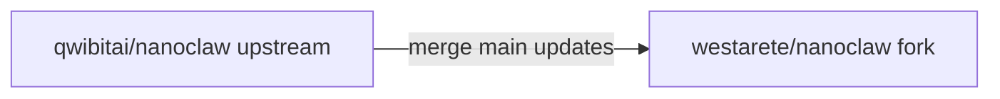
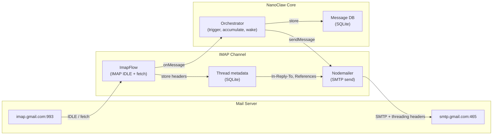
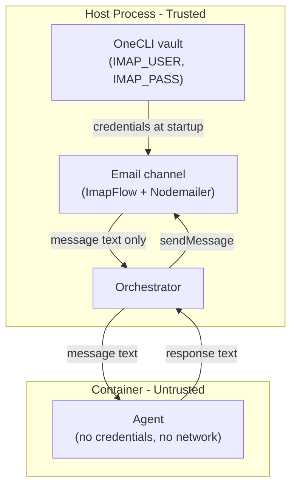
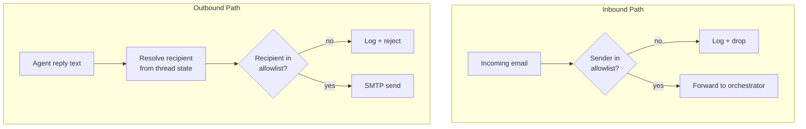

# Phase 1: Email Channel Skill

> **Canonical location:** [`westarete/nanoclaw`](https://github.com/westarete/nanoclaw) · **`.claude/skills/add-email/PLAN.md`**. Email-channel **development** (implementation and this plan) targets branch **`skill/email`**, not **`main`** — **`main`** tracks [`qwibitai/nanoclaw`](https://github.com/qwibitai/nanoclaw) until you merge the skill. Keep this directory on **`skill/email`** with the channel implementation and docs (or split docs from code deliberately if you choose).  
> **CPSA / Victor** (separate repo): [`cpsa-aero/nanoclaw-cpsa`](https://github.com/cpsa-aero/nanoclaw-cpsa) — [private deploy & remotes](https://github.com/cpsa-aero/nanoclaw-cpsa/blob/main/plans/02-victor/nanoclaw-cpsa-repo.md) · [Victor plan tree](https://github.com/cpsa-aero/nanoclaw-cpsa/tree/main/plans/02-victor).

Build a new NanoClaw channel skill (`/add-email`) that makes email a
first-class channel via IMAP/SMTP. Generic infrastructure — not
CPSA-specific — reusable by any NanoClaw installation.

**Naming decision:** The skill is called `/add-email`, not `/add-imap`.
IMAP/SMTP are the mechanism; the capability is "participate in email
conversations." This matches the naming pattern of every other channel
skill (`/add-whatsapp`, `/add-telegram`, `/add-slack`) — named after
the platform, not the protocol.

**Planning posture:** **Security is not a separate topic or an optional late pass.** Threat model and trust boundaries are part of how the channel is shaped from the start; architecture here is **driven by** security, not decorated with it afterward. Do not carve security into its own document or treat it as something you read only after the “main” design. (Splitting other parts of this plan into additional files is fine if it helps — just not security in isolation.)

## Why a new skill?

The existing `/add-gmail` skill was designed for personal assistant
notification ("forward emails to WhatsApp"). It has architectural
gaps that make it unsuitable for email-native group participation.
See [comparison](#comparison-add-email-vs-add-gmail) below.

The new email skill is designed for bots that live on email, participate
in threads, and operate autonomously.

## Skill layering decision

Considered whether this should be split into layers:

1. `/add-imap` — raw protocol plumbing (IMAP/SMTP)
2. `/add-group-email` — mailing list participation behavior
3. Victor — deployment configuration

**Decision: two things, not three.** The "group email participation"
behavior isn't a separate layer — it's what NanoClaw's orchestrator
already provides. Mailing list emails accumulate in a registered group
(same as Telegram/WhatsApp group chat messages). The trigger system
gates when the agent wakes. Scheduled tasks handle automation.
Direct vs. group detection is a protocol concern (parsing To/Cc/List-Id
headers), not a behavior concern. There's no meaningful middle layer
to extract.

A normal `/add-email` user who registers a mailing list as a NanoClaw
group gets smart participation for free — the bot accumulates context
from group threads, responds when triggered, and can send scheduled
updates. Victor adds domain logic (crew rules, weather, roster) via
CLAUDE.md and scheduled tasks, not via a separate skill.

## Repository layout and Git workflow

This skill is developed and published in a **West Arete** public fork and contributed **upstream**. The mechanics match NanoClaw’s fork + `skill/*` branch model ([`CONTRIBUTING.md`](../../../CONTRIBUTING.md), [`docs/skills-as-branches.md`](../../../docs/skills-as-branches.md)). CPSA production fork layout is in [`cpsa-aero/nanoclaw-cpsa`](https://github.com/cpsa-aero/nanoclaw-cpsa) — [nanoclaw-cpsa-repo.md](https://github.com/cpsa-aero/nanoclaw-cpsa/blob/main/plans/02-victor/nanoclaw-cpsa-repo.md) (same links as the callout above).

### Mental model

- **Core** — [`qwibitai/nanoclaw`](https://github.com/qwibitai/nanoclaw): add as remote **`upstream`**, sync with `/update-nanoclaw` ([`.claude/skills/update-nanoclaw/SKILL.md`](../update-nanoclaw/SKILL.md)).
- **Feature skills** — Full git branches (`skill/<name>`), not a separate library repo; install with `git merge`. Deployments = upstream core + merged skills + private `groups/*/CLAUDE.md` and config.

### Channel vs skill vs branch name

- **Channel** — Runtime: an email integration beside WhatsApp/Telegram (implements the channel interface, registers in [`src/channels/registry.ts`](../../../src/channels/registry.ts)).
- **Feature skill** — Distribution: slash command **`/add-email`**, `SKILL.md` under `.claude/skills/`, merge of a **`skill/*`** branch.
- **Git branch** — Short name, like upstream’s `skill/gmail` / `skill/telegram`: use **`skill/email`**. The slash command stays **`/add-email`**; the skill folder may be `.claude/skills/add-email/`.



### Repositories

| Repo | Visibility | Role |
|------|------------|------|
| `qwibitai/nanoclaw` | Public | **`upstream`** — core + official `skill/*` |
| `westarete/nanoclaw` | Public | Fork — develop **`skill/email`**, open PR to upstream |
| `westarete/nanoclaw-skills` | Public | **West Arete marketplace** — Claude Code plugin ([community marketplaces](https://github.com/qwibitai/nanoclaw/blob/main/docs/skills-as-branches.md#community-marketplaces)): `marketplace.json`, plugin bundling **`/add-email`** `SKILL.md`, same layout as `qwibitai/nanoclaw-skills` |

### Community marketplace (`westarete/nanoclaw-skills`)

**Plan:** maintain a **dedicated marketplace repo** alongside the fork — not optional fluff on the path to upstream.

Per [Community Marketplaces](https://github.com/qwibitai/nanoclaw/blob/main/docs/skills-as-branches.md#community-marketplaces), that means:

1. **`.claude-plugin/marketplace.json`** and the plugin tree (mirror upstream’s [`qwibitai/nanoclaw-skills`](https://github.com/qwibitai/nanoclaw-skills) structure — single plugin, `skills/add-email/SKILL.md`, etc.).
2. **`SKILL.md` content** stays authoritative on the **`skill/email`** branch of **`westarete/nanoclaw`** (or copy from there into the marketplace repo when publishing); install step 1 remains **`git merge`** of **`skill/email`** from the fork remote.

**Why this helps the upstream merge:**

- **Same distribution story as official skills** — reviewers and early adopters can **`claude plugin install`** West Arete’s marketplace and run **`/add-email`** without hunting a branch URL.
- **Parallels the maintainer flow** — upstream’s [maintainer flow](https://github.com/qwibitai/nanoclaw/blob/main/docs/skills-as-branches.md) adds `SKILL.md` to `qwibitai/nanoclaw-skills` after merge; you rehearse that by shipping **`westarete/nanoclaw-skills`** first.
- **Evidence of end-to-end readiness** — discoverability + merge instructions prove the skill is installable, not only that code exists on a branch.

**Optional (later):** open a PR to [`qwibitai/nanoclaw`](https://github.com/qwibitai/nanoclaw) **`.claude/settings.json`** to add **`westarete/nanoclaw-skills`** under `extraKnownMarketplaces` so all users see it beside the official marketplace — only if/when upstream is comfortable listing it ([same doc](https://github.com/qwibitai/nanoclaw/blob/main/docs/skills-as-branches.md#adding-a-community-marketplace)). Users can always add the marketplace manually via **`/plugin marketplace add`** without that PR.

**After upstream merges** the core PR, upstream typically adds **`SKILL.md`** to **`qwibitai/nanoclaw-skills`**; **`westarete/nanoclaw-skills`** can drop duplicate **`/add-email`** entries or keep them for West Arete–specific variants — project decision at merge time.

**West Arete fork (`westarete/nanoclaw`):** `main` tracks upstream; all IMAP/SMTP work lives on **`skill/email`** until merged upstream. Manual merge (unchanged):

```bash
git remote add westarete https://github.com/westarete/nanoclaw.git
git fetch westarete skill/email && git merge westarete/skill/email
```

**One fork, many future skills:** Same pattern as upstream — `westarete/nanoclaw` with multiple `skill/*` branches, not one GitHub repo per skill. Dependent skills branch from their parent `skill/...` in git.

**Why the fork homepage can look sparse:** Default branch is `main` (upstream parity); skill code is on `skill/email`. The root README on `main` includes a short West Arete notice and link to [`.claude/skills/add-email/README.md`](https://github.com/westarete/nanoclaw/blob/skill/email/.claude/skills/add-email/README.md); you can also use a pinned issue, repo About link, topics (`nanoclaw`, etc.), and upstream PRs.

**Day to day:** Develop on `westarete`, branch `skill/email`. Downstream deploys merge that skill (or `upstream/skill/email` after it lands) into their own forks — for CPSA/Victor, see [nanoclaw-cpsa-repo.md](https://github.com/cpsa-aero/nanoclaw-cpsa/blob/main/plans/02-victor/nanoclaw-cpsa-repo.md) on `cpsa-aero/nanoclaw-cpsa`.

### Contribution path

1. Develop on `westarete/nanoclaw`, branch **`skill/email`** (channel + tests + `.claude/skills/add-email/` on the branch).
2. **Publish `westarete/nanoclaw-skills`** with **`/add-email`** in the plugin catalog so installs match the [community marketplace](https://github.com/qwibitai/nanoclaw/blob/main/docs/skills-as-branches.md#community-marketplaces) model — ideally **before or alongside** the upstream PR so reviewers can try **`/plugin`** → **`/add-email`**.
3. PR to **`qwibitai/nanoclaw`** ([`CONTRIBUTING.md`](../../../CONTRIBUTING.md)); one capability per PR.
4. After upstream merges, installs can merge **`upstream/skill/email`** instead of **`westarete/skill/email`**; upstream maintainers add **`SKILL.md`** to **`qwibitai/nanoclaw-skills`** per usual ([maintainer flow](https://github.com/qwibitai/nanoclaw/blob/main/docs/skills-as-branches.md)).
5. (Optional) PR to upstream **`settings.json`** to register **`westarete/nanoclaw-skills`** for auto-discovery.

### Setup checklist

- [ ] Create **`westarete/nanoclaw`** fork; push **`skill/email`**; ensure **`upstream`** remote points at qwibitai.
- [ ] Create **`westarete/nanoclaw-skills`**, plugin layout + **`/add-email`** `SKILL.md`, document install via merge from **`westarete/skill/email`**.
- [ ] When ready, open upstream PR from West Arete fork (after marketplace is publishable, if following the path above).

## WhatsApp-native assumptions in NanoClaw

NanoClaw was born as a WhatsApp bot. Its core abstractions still
reflect that origin, even for deployments that don't use WhatsApp.

- **"JID" terminology** — Every chat identifier is called a JID
  (Jabber ID), from WhatsApp's XMPP roots. Telegram uses chat IDs,
  Discord uses channel IDs, email uses addresses. They all get mapped
  into "JID" because that's what the DB schema, router, and
  orchestrator were built around.
- **`sendMessage(jid, text)`** — The Channel interface assumes
  chat-style simplicity: send text to a conversation. Email needs
  recipients, subject lines, and threading headers (In-Reply-To,
  References). The email channel has to reconstruct this context
  internally from the JID and its own thread state.
- **Flat message model** — The orchestrator treats messages as a
  chronological stream per group. Email has explicit threading
  (References chains, subject grouping). The channel must flatten
  threaded email into the stream model while preserving enough
  metadata to thread outbound replies correctly.

These aren't problems to fix now — the abstractions are thin enough
that the email channel can work within them. But they're worth
being aware of when making design decisions. The email channel is
building email support inside a system whose mental model is
"group chat."

## Architecture

Built on [ImapFlow](https://github.com/postalsys/imapflow) (receive)
and [Nodemailer](https://nodemailer.com) (send) — mature, well-maintained
libraries with native support for threading and IDLE push.

**Inbound transport (why IMAP, which library, not POP):**

- **ImapFlow** — Actively maintained, TypeScript-first, intended for long-lived clients: IMAP IDLE (push), mailbox locks, documented reconnect and fetch patterns — matches this channel’s IDLE-first design.
- **Not [`imap-simple`](https://www.npmjs.com/package/imap-simple)** — CommonJS wrapper around `node-imap`; upstream repo is **archived** (stale), with no comparable IDLE story. Fine as [prior art](#community-prior-art-node-imap-openclaw-skills) for operational patterns, **not** as a dependency for the shipped channel.
- **POP3 — out of scope for v1** — No IDLE; effectively poll-only; no folder model for filters / multi-mailbox workflows. Revisit only if a real deployment **cannot** use IMAP at all.



## What the skill provides

- **IMAP connection** with IDLE (push) or configurable polling
- **Auth**: plain credentials (username + app password), managed by
  OneCLI vault — never exposed to containers
- **Inbound processing**: fetch envelope + headers + body, parse sender
  (`From`), detect direct vs. group delivery (`To`/`Cc`/`List-Id`),
  extract `Message-ID`/`In-Reply-To`/`References` for threading
- **Thread persistence**: store thread metadata in SQLite (survives restarts)
- **Outbound via SMTP**: Nodemailer with `inReplyTo`, `references`,
  `subject` for proper threading. Can send to individuals or groups.
- **HTML fallback**: extract text from HTML-only emails
- **JID scheme**: `email:<address>` as the registered group JID,
  with thread metadata in the side table
- **No Gmail tab/category problem**: IMAP sees the full inbox regardless
  of Gmail's UI categorization

## Key design decisions

- **JID scheme**: `email:<address>` as the registered group JID.
  Thread metadata in a SQLite side table keyed by email thread ID.
- **Direct vs. group detection**: parse `To`, `Cc`, and `List-Id`
  headers to determine delivery path. Direct email to the bot address
  vs. mailing list delivery.
- **Trigger integration**: leverages NanoClaw's existing `requiresTrigger`
  system. Group thread replies accumulate silently as context. Direct
  emails mentioning the trigger word wake the agent. Scheduled tasks
  bypass triggers.
- **Thread persistence**: SQLite table for `Message-ID`, `In-Reply-To`,
  `References`, sender, subject per thread. Survives restarts.
- **IDLE vs. polling**: IMAP IDLE by default for near-instant delivery.
  Falls back to polling if IDLE is unsupported.

## Auth

Plain credentials only: username + app-specific password. Managed by
OneCLI vault on the host — the IMAP channel reads them at startup,
containers never see them. Works with any IMAP/SMTP provider (Gmail,
Fastmail, self-hosted, etc.).

For Google Workspace accounts: enable 2FA on the bot's Workspace
account, generate an app password, store it in OneCLI. No service
account, no OAuth, no JWT, no token refresh.

## Security boundaries

The email channel enforces a structural separation between the host
process (trusted, holds credentials) and the container agent
(untrusted, processes user content). This is the
[Agents Rule of Two](https://ai.meta.com/blog/practical-ai-agent-security/)
applied at the channel level.



**What the container never gets:**
- IMAP/SMTP credentials (held by OneCLI, read by host process)
- Direct network access to mail servers
- Thread metadata or email headers (the channel flattens these
  into the message stream)

**What the container does get:**
- Message text (sender name, body) delivered through the orchestrator
- Read-only data files staged by host-side tasks (roster, weather,
  etc. — configured per deployment, not per channel)
- Write access to its own group folder only

The channel is the trust boundary. It authenticates to the mail
server, processes raw email (headers, MIME, HTML), and exposes
only clean message text to the orchestrator. The agent reasons
about content and produces reply text. It never touches email
infrastructure directly.

### Sender and recipient allowlists

The channel supports optional allowlisting on both sides,
enforced structurally in host-side code. No prompt can bypass
these because the agent never controls sender filtering or
recipient addressing.

**Inbound allowlist.** When configured, the channel checks
the `From` address of every inbound email against an allowlist
before forwarding to the orchestrator. Emails from unknown
senders are logged and silently dropped — the agent never sees
them. This is defense-in-depth: for group traffic, Google Groups
already rejects non-members, but direct emails to the bot address
bypass that filter. The inbound allowlist catches those at the
channel level.

**Outbound allowlist.** The agent never specifies recipients —
`sendMessage(jid, text)` provides only text. The channel resolves
recipients from its own thread state (envelope headers for replies,
configured group address for scheduled sends). Before sending, it
validates the resolved recipient against the allowlist. Unauthorized
recipients are logged and rejected.

**Allowlist source.** Configurable per deployment — a static list,
a file path (e.g., a staged roster file), or both. The channel
reloads the file periodically or on change. The agent cannot
modify the source (read-only mount or host-side file outside the
container's filesystem).



This means a prompt injection in an inbound email can influence
the agent's *reasoning* but cannot exfiltrate credentials, send
email to unauthorized recipients, or access other groups' data.
The blast radius is limited to the agent's own group folder
and its reply within the current thread — and only to senders
already on the allowlist.

## Dependencies

| Component | Library | Purpose |
|-----------|---------|---------|
| IMAP receive | `imapflow` | Inbox monitoring, IDLE, message fetch |
| SMTP send | `nodemailer` | Outbound with threading headers |
| HTML parsing | `html-to-text` | Fallback for HTML-only emails |

## Deliverables

| File | Purpose |
|------|---------|
| `src/channels/email.ts` | Channel implementation (~500-600 lines) |
| `src/channels/email.test.ts` | Unit tests (~150-200 lines) |
| `.claude/skills/add-email/SKILL.md` | Setup instructions, auth walkthrough |
| `package.json` changes | `imapflow`, `nodemailer`, `html-to-text` (no Google libraries) |

## Open design questions

Questions to resolve before implementation.

### 1. sendMessage(jid, text) vs. email's richer semantics

The Channel interface is `sendMessage(jid: string, text: string)`.
Email replies need threading headers (`In-Reply-To`, `References`),
a recipient address, and a subject line. How does the IMAP channel
reconstruct these from just a JID and text body?

Options to consider:
- Encode thread ID in the JID (like Gmail does with `gmail:${threadId}`)
- Parse structured headers from the text body
- Store "reply context" per group and have the channel auto-thread
  to the most recent inbound thread
- Extend the interface with optional metadata

### 2. One IMAP account, two email flows

`victor@cpsa.aero` receives both direct emails and `flying@cpsa.aero`
group traffic. These need fundamentally different handling:

- **Group emails** → accumulate silently (no trigger), become context
  for scheduled tasks
- **Direct emails** mentioning `@Victor` → wake agent, reply to sender

Does this map to one NanoClaw group or two? If one, how does the
trigger system distinguish the two flows? If two, how does one IMAP
connection feed two groups?

### 3. Scheduled task outbound

Wednesday's email starts a **new thread** to `flying@cpsa.aero`.
Thursday and Friday **reply to that same thread**. The scheduler
sends a prompt to the agent, gets text back, and calls `sendMessage`.
How does the channel know:

- Wednesday: start a new thread, send to `flying@cpsa.aero`
- Thursday: reply to Wednesday's thread in `flying@cpsa.aero`

The agent in the container has no direct access to IMAP thread state.
Does the channel track "current weekly thread"? Does the agent use
an MCP tool to compose email with explicit headers?

### 4. Thread lifecycle and JID scheme

- When does a thread "end"? Victor's weekly cycle creates a new thread
  each Wednesday. But what if someone replies to last week's thread
  on Tuesday?
- How are threads encoded in JIDs? `email:<address>` is the group-level
  JID, but `sendMessage` needs thread-level routing.
- How does thread state survive restarts? (Plan says SQLite, but the
  schema needs design.)
- What happens when multiple threads are active simultaneously?

---

## Development estimate

2-3 days of focused work. The channel interface is simple (6 required
methods), ImapFlow and Nodemailer handle protocol complexity, and
NanoClaw's trigger system already supports the accumulate-then-wake
pattern needed for group email. Open design questions above may
add time.

---

## Comparison: `/add-email` vs. `/add-gmail`

### Different motivations, not just different protocols

`/add-gmail` gives an existing bot background access to a user's
personal email account. The user interfaces with the bot through
WhatsApp or Telegram; email is a secondary data source. The bot
borrows the user's Gmail identity.

`/add-email` creates a bot that IS the email identity. The community
knows the bot through its own email address and personality. Email
is the primary interface, not a background resource.

This motivational difference leaks into the channel layer:

| Concern | Gmail (background resource) | Email (primary identity) |
|---------|---------------------------|-------------------------|
| **Outbound recipients** | Always replies to original sender (`To: ${meta.sender}`) | Must route to sender OR mailing list depending on context |
| **Thread initiation** | Can only reply — `sendMessage` fails silently if no thread metadata | Must compose new threads (e.g. Wednesday availability email) |
| **Message routing** | Everything to main group JID | Per-list JID routing to separate registered groups |
| **Inbound filtering** | `is:unread category:primary` — filters out Forums/Groups | Sees full inbox — all traffic to a bot account is relevant |
| **Identity** | Bot borrows user's account; sends as the user | Bot IS the account; `From:` is the bot's own address |

### Protocol comparison

`/add-gmail` uses the Gmail REST API (`googleapis`). `/add-email`
uses IMAP/SMTP (ImapFlow + Nodemailer).

| Capability | Gmail (API) | Email (IMAP/SMTP) |
|-----------|------------|-------------------|
| Provider support | Gmail only | Any IMAP server |
| Inbox monitoring | Polls every 60s via API | IMAP IDLE (near-instant) + poll fallback |
| Threading (inbound) | Gmail `threadId` (server-side) | RFC-822 `In-Reply-To`/`References` |
| Threading (outbound) | `threadId` on API send, in-memory only | SMTP headers, persisted in SQLite |
| Auth | OAuth Desktop app only | Plain credentials via OneCLI (provider-agnostic) |
| Thread persistence | In-memory map (lost on restart) | SQLite (survives restart) |
| Direct vs. group | No detection | Parses `To`/`Cc`/`List-Id` headers |
| HTML emails | Silently dropped | Converted to text via `html-to-text` |

The email channel is a superset of the Gmail channel's channel
capabilities. Every capability the Gmail channel provides, the email
channel does at least as well.

### What Gmail provides that we don't replicate

The Gmail skill bundles an MCP server (`@gongrzhe/server-gmail-autoauth-mcp`)
inside the container that gives the agent tools to search, read, draft,
and send emails independently. These are container-side tools, not
channel concerns — they're orthogonal to the channel and could be
added independently.

**Drafts specifically:** Gmail API `users.drafts.create` produces a
first-class draft in the Gmail UI that the user can open, edit, and
send. IMAP can `APPEND` to the Drafts folder, but Gmail's web UI
won't reliably open it as an editable compose window. For Victor
this doesn't matter (he sends autonomously). For a personal email
assistant it could — worth revisiting if that use case emerges.

## Existing channel patterns worth following

Analysis of all four upstream channel implementations (WhatsApp,
Telegram, Slack, Gmail) for patterns the email channel should adopt.

### Telegram: threading model

The Telegram channel already handles threading via forum topics.
It stores `thread_id` on inbound messages and passes an optional
`threadId` parameter to `sendMessage` — stretching the Channel
interface beyond its declared `(jid, text)` signature:

```typescript
// Inbound
thread_id: threadId ? threadId.toString() : undefined,

// Outbound
async sendMessage(jid: string, text: string, threadId?: string)
```

Telegram also captures **reply-to context** (`reply_to_message_id`,
`reply_to_message_content`, `reply_to_sender_name`) — the same
concept as email's `In-Reply-To` header. The email channel will
need a similar (but richer) approach to threading metadata on both
the inbound and outbound paths.

### WhatsApp: identity ownership

WhatsApp has a config flag `ASSISTANT_HAS_OWN_NUMBER` that controls
whether the bot has its own phone number or shares the user's. This
maps directly to the Gmail vs. email channel distinction:

- **Shared identity** (Gmail channel ≈ WhatsApp shared number): bot
  borrows the user's account, prefixes messages with
  `${ASSISTANT_NAME}:` to identify itself
- **Own identity** (email channel ≈ WhatsApp own number): bot IS the
  account, identity is inherent in the `From:` header / phone number

The email channel always operates in "own identity" mode.

### Slack: group participation

The cleanest model for the core group participation pattern:

- **Mention-to-trigger translation**: All three group-capable channels
  translate platform @mentions into NanoClaw's trigger format. Email
  doesn't have platform @mentions but uses the same pattern — scan
  the message body for the trigger word.
- **User name resolution**: Slack calls `users.info` to turn platform
  IDs into real names. Email parses the `From` header.
- **Outgoing queue with reconnect flush**: Both WhatsApp and Slack
  queue outbound messages when disconnected and flush on reconnect.
  The email channel should do the same — IMAP connections drop.
- **Group metadata sync**: WhatsApp and Slack periodically sync group
  names. The email channel could scan `List-Id` headers for list
  names.

### Summary

| Channel | Relevant model | What it teaches the email channel |
|---------|---------------|----------------------------------|
| Telegram | Threading | `thread_id` on inbound + outbound; reply-to context; the interface is already being stretched |
| WhatsApp | Identity ownership | "Bot IS the account" vs "bot borrows the account" — already solved with `ASSISTANT_HAS_OWN_NUMBER` |
| Slack | Group participation | Cleanest example of mention translation, name resolution, outgoing queue, multi-group JID routing |
| Gmail | What NOT to do | Background resource pattern; everything-to-main; in-memory state; no group awareness |

---

## Reference: authoritative code examples

Concrete links to documentation, examples, and upstream source code
for every library and integration point. Follow these when building —
do not improvise API usage from memory.

### ImapFlow (IMAP receive)

| Use case | Reference |
|----------|-----------|
| **Connection + plain auth** | [Configuration guide](https://imapflow.com/docs/guides/configuration) — `auth: { user, pass }`, TLS, timeouts |
| **IDLE monitoring** | [Basic Usage — events](https://imapflow.com/docs/guides/basic-usage) — listen for `exists` event; auto-IDLE is default, no manual IDLE calls needed |
| **Envelope parsing** (From, To, Cc, Subject, Message-ID, In-Reply-To) | [Fetching Messages — envelope](https://imapflow.com/docs/guides/fetching-messages) — `fetchOne('*', { envelope: true })`, fields at `message.envelope.*` |
| **Specific header fetch** (List-Id, References) | [Fetching Messages — headers](https://imapflow.com/docs/guides/fetching-messages) — `fetchOne('*', { headers: ['List-Id', 'References'] })` |
| **Body text extraction** | [Fetching Messages — bodyParts](https://imapflow.com/docs/guides/fetching-messages) — `bodyParts: ['TEXT']` |
| **Search** (unseen, by sender, by date) | [Searching guide](https://imapflow.com/docs/guides/searching) — criteria objects, `from:`, `seen:`, `since:`, header search |
| **Gmail-specific search** | [Searching — Gmail raw](https://imapflow.com/docs/guides/searching) — `{ gmraw: 'label:...' }` |
| **Mailbox locking** | [Basic Usage — locks](https://imapflow.com/docs/guides/basic-usage) — always `getMailboxLock` + `finally { lock.release() }` |
| **Reconnection** | [Basic Usage — disconnections](https://imapflow.com/docs/guides/basic-usage) — no auto-reconnect; handle `close` event, rebuild client |
| **fetchAll vs fetch deadlock** | [Fetching Messages — warning](https://imapflow.com/docs/guides/fetching-messages) — never run IMAP commands inside `fetch()` iterator; use `fetchAll()` then process |
| **IDLE config** | [Configuration — IDLE options](https://imapflow.com/docs/guides/configuration) — `maxIdleTime`, `disableAutoIdle`, `missingIdleCommand: 'NOOP'` |
| **Full API reference** | [ImapFlow Client API](https://imapflow.com/docs/api/imapflow-client) |
| **Code examples** | [Fetching Messages examples](https://imapflow.com/docs/examples/fetching-messages) |

### Nodemailer (SMTP send)

| Use case | Reference |
|----------|-----------|
| **Gmail + app password config** | [Using Gmail guide](https://nodemailer.com/guides/using-gmail) — `service: 'gmail'` shortcut or explicit `host: 'smtp.gmail.com'` |
| **Google Workspace relay** | [Using Gmail — Workspace relay](https://nodemailer.com/guides/using-gmail) — `service: 'GmailWorkspace'` uses `smtp-relay.gmail.com`, preserves `From:` header |
| **Threading headers** (`inReplyTo`, `references`) | [SO: threading with Nodemailer](https://stackoverflow.com/questions/23007197/how-to-cause-sent-emails-to-appear-threaded-in-gmail-recipients-view-with-messa) — `inReplyTo: '<msg-id>'`, `references: ['<id1>', '<id2>']`, must match subject |
| **Transporter creation + reuse** | [Nodemailer Usage](https://nodemailer.com/usage/) — create once, reuse for all sends |
| **Connection verification** | [Nodemailer Usage — verify](https://nodemailer.com/usage/) — `transporter.verify()` for pre-flight check |
| **Send response handling** | [Nodemailer Usage — response](https://nodemailer.com/usage/) — `info.messageId`, `info.accepted`, `info.rejected` |
| **Gmail quirks** | [Using Gmail — quirks](https://nodemailer.com/guides/using-gmail) — Gmail rewrites `From:` header; 500 recipients/day (personal), 2000 (Workspace) |

**Critical threading detail:** for Gmail to thread replies correctly,
all three must match: `inReplyTo` (parent Message-ID), `references`
(full chain), and `subject` (with or without `Re:` prefix). Omitting
any one can break threading. See the
[StackOverflow thread](https://stackoverflow.com/questions/23007197/how-to-cause-sent-emails-to-appear-threaded-in-gmail-recipients-view-with-messa)
for tested, working examples.

### html-to-text (HTML email fallback)

| Use case | Reference |
|----------|-----------|
| **Basic conversion** | [GitHub README](https://github.com/html-to-text/node-html-to-text) — `const { convert } = require('html-to-text'); convert(html, { wordwrap: 130 })` |
| **Compiled converter** (reuse for multiple emails) | [npm page](https://www.npmjs.com/package/html-to-text) — `const compiledConvert = compile(options); texts.map(compiledConvert)` |
| **Nodemailer plugin** (auto-generate text from HTML) | [nodemailer-html-to-text](https://www.npmjs.com/package/nodemailer-html-to-text) — `transporter.use('compile', htmlToText())` |

### NanoClaw core contracts (in this repo)

| Contract | File | Lines | What it defines |
|----------|------|-------|-----------------|
| **Channel interface** | `src/types.ts` | 87-98 | `connect()`, `sendMessage(jid, text)`, `isConnected()`, `ownsJid()`, `disconnect()`, optional `setTyping()`, `syncGroups()` |
| **NewMessage interface** | `src/types.ts` | 45-58 | `id`, `chat_jid`, `sender`, `sender_name`, `content`, `timestamp`, threading fields (`thread_id`, `reply_to_*`) |
| **Channel registration** | `src/channels/registry.ts` | 7-20 | `ChannelOpts`, `ChannelFactory`, `registerChannel(name, factory)` |
| **Channel barrel** | `src/channels/index.ts` | 1-12 | Import side-effects trigger registration; add `import './email.js'` |
| **Startup loop** | `src/index.ts` | 676-691 | Iterates registered channels, calls factory, connects |
| **Inbound handler** | `src/index.ts` | 636-674 | `onMessage` callback: remote control, sender allowlist, `storeMessage()` |
| **Outbound routing** | `src/router.ts` | 44-51 | `routeOutbound()`: finds channel via `ownsJid` + `isConnected`, calls `sendMessage` |
| **Message formatting** | `src/router.ts` | 13-26 | `formatMessages()`: XML with reply-to context, quoted messages |
| **Volume mounts** | `src/container-runner.ts` | 61-224 | `buildVolumeMounts()`: main vs non-main, read-only project root, `.env` shadow, group dir, IPC, additional mounts |
| **Sender allowlist** (existing) | `src/index.ts` | 646-660 | `loadSenderAllowlist()`, `shouldDropMessage()`, `isSenderAllowed()` — pattern to extend for email allowlists |

### Upstream channel implementations (merge from skill branches)

These are the concrete channel implementations in other repos.
Fetch and read them before building the email channel — they are
the authoritative examples of how to implement the Channel interface.

| Channel | Repo | Key patterns to study |
|---------|------|-----------------------|
| **Telegram** | [`qwibitai/nanoclaw-telegram`](https://github.com/qwibitai/nanoclaw-telegram) | Threading via `thread_id` on inbound + outbound; `sendMessage` with optional `threadId` parameter; reply-to context capture; mention-to-trigger translation |
| **Slack** | [`qwibitai/nanoclaw-slack`](https://github.com/qwibitai/nanoclaw-slack) | Cleanest group participation pattern; `users.info` name resolution; outgoing queue with reconnect flush; multi-group JID routing |
| **WhatsApp** | [`qwibitai/nanoclaw-whatsapp`](https://github.com/qwibitai/nanoclaw-whatsapp) | `ASSISTANT_HAS_OWN_NUMBER` identity model; reconnection logic; group metadata sync; message queue |
| **Discord** | [`qwibitai/nanoclaw-discord`](https://github.com/qwibitai/nanoclaw-discord) | Channel-per-group JID mapping |
| **Gmail** | [`qwibitai/nanoclaw-gmail`](https://github.com/qwibitai/nanoclaw-gmail) | What NOT to do — but useful for understanding the existing `threadMeta` pattern and Gmail API threading via `threadId` |

### Community prior art: Node IMAP (OpenClaw skills)

This plan standardizes on **ImapFlow** for IMAP receive (see [ImapFlow](#imapflow-imap-receive) above). The following is **not** the same stack — it uses [`imap-simple`](https://www.npmjs.com/package/imap-simple) plus [`mailparser`](https://www.npmjs.com/package/mailparser) in a standalone CLI — but it is useful for **operational patterns**: UNSEEN search, UID fetch, mark read/unread, mailbox listing, and TLS / ProtonMail Bridge–style `rejectUnauthorized` configuration.

| Resource | Notes |
|----------|-------|
| **[mvarrieur/imap-email](https://github.com/openclaw/skills/tree/main/skills/mvarrieur/imap-email)** | OpenClaw community skill ([`scripts/imap.js`](https://github.com/openclaw/skills/blob/main/skills/mvarrieur/imap-email/scripts/imap.js)) — `check`, `fetch`, `search`, `mark-read` / `mark-unread`, `list-mailboxes`; documented in [`SKILL.md`](https://github.com/openclaw/skills/blob/main/skills/mvarrieur/imap-email/SKILL.md). |

**Before writing code:** fetch at least Telegram and Slack channel
source (`git fetch telegram main && git show telegram/main:src/channels/telegram.ts`)
to see concrete implementations of the Channel interface, especially
`connect()`, `sendMessage()`, reconnection, and how they populate
`NewMessage` fields. Do not build from scratch — adapt from these.

## Other planning

- [security-principles.md](security-principles.md) — NanoClaw security principles (a copy also lives under `plans/02-victor/` in this working tree until that tree moves to the CPSA repo).
